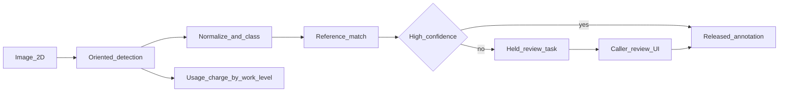

# Goals and initiatives for a billable annotation service

The charter, [ADR-001](02-adr-001-detection-engine-strategy.md), and [PRD](03-prd.md) describe one outcome: extract text from an image, match it to a caller-registered S3 JSON reference, and return annotations. They are not yet a billable product, and they assume axis-aligned boxes with no review UI. The decisions below replace that scope.

## Goals

Outcomes the billable product must achieve:

- Extract every text region from a **2D image**, including engineering drawings where text is horizontal, vertical, upside down, outside the sheet, or slightly rotated.
- Represent each region as a **quadrilateral** with an orientation, plus raw transcript, normalized transcript, confidence, and an **engineering text class** (dimension, tolerance, thread callout, surface finish, part tag, revision, sheet metadata, note).
- Match **normalized** text to the caller-registered reference (S3 JSON, `source_id`) and return `matched_ref` and `match_score`.
- **Release** high-confidence annotations on the sync response. **Hold** low-confidence ones until the caller’s user accepts or edits them in a minimal review UI.
- Charge **once per image** when detection finishes, priced by **work level** (`standard` or `oriented`). Review and edits add no second charge.
- Keep the engine on self-hosted **PaddleOCR** so the common case stays cheap.

## Initiatives required to bill

These are the bodies of work. The product is billable only when all six exist.

- **Oriented detection.** Tile large images, detect four-corner regions with PP-OCR, rectify each crop, try 0/90/180/270, keep the best transcript. Choose `standard` (one pass) or `oriented` (tile + rectify + four-way) and record which one ran. Log confidence on every region.
- **Engineering normalization.** Assign a text class and a normalized transcript with format rules (for example `M1O x 1.75` to `M10 × 1.75`). Keep the raw string. Produce a domain-validation score used, with OCR confidence, to decide release vs hold.
- **Reference match.** Keep the PRD registration API (`POST /v1/match-config`, S3 JSON only). Match normalized text with regex and fuzzy match. Unknown `source_id` is a 404 and does not detect.
- **Review hold.** Sync `POST /v1/detect` returns released annotations plus held review tasks. It does not wait on a person. A minimal UI lets the caller’s user accept or edit held regions, then releases them. No in-house review team.
- **Usage charge.** One charge per image at detection finish, keyed by work level. Later edits do not rebill. Attribute the charge to the caller (API key at minimum).
- **Contract update.** Extend `Annotation` with polygon, rotation, raw and normalized text, text class, validation score, and release state. Add review-task reads and correction writes under `/v1`.

## Not required to bill

- DWG, DXF, or other CAD-native extraction. Input is a 2D image.
- Keypoints, masks, and generic object boxes.
- Associating text with leaders, dimension lines, title-block zones, or BOM cells.
- PaddleOCR alternatives (ADR-001 Tier 1 and Tier 2). Those remain engine choices, not prices.
- Semantic or embedding match, extra reference-source types, and an SDK.
- A second charge for review.

## Terms that collide with the current docs

- **Annotation** in the PRD is an axis-aligned text box plus a match. It becomes a quadrilateral engineering-text record that is either released or held.
- **Tier** in ADR-001 is the OCR engine. Price uses **work level** instead. Engine for this cut stays PaddleOCR.
- **No review UI** in the charter is reversed for held regions only. The caller’s user reviews. We do not staff reviewers.
- **Billing in v0.3** moves into this cut. Async batch jobs stay deferred, except the review task, which cannot be synchronous.

S3 JSON remains the only reference source, carried forward from the charter.

## Doc updates after confirmation

Follow the repo’s numbered root docs, not a new `docs/adr/` tree.

- Add [CONTEXT.md](CONTEXT.md) as a glossary only: Image, Text region, Text class, Transcript, Annotation, Released, Held, Review task, Reference source, Match, Work level, Engine, Usage charge. Point `_Avoid_` at “tier” for price, “CAD file” for input, and “labeling task” for review.
- Revise [01-charter.md](01-charter.md) so section 2 is the goals above, section 3 drops the blanket UI ban and names the deferred list, and section 7 replaces v0.1–v0.3 with the six initiatives plus explicit deferrals.
- Add `04-adr-002-work-level-pricing-and-review-hold.md`: price by work level rather than engine tier; hold low-confidence regions for the caller’s user; one charge per image. Note that this narrows ADR-001’s “price by engine tier” consequence without changing the PaddleOCR engine choice.
- Revise [03-prd.md](03-prd.md) annotation fields, the detect response (released plus held), review endpoints, and scenarios for immediate release, hold-then-edit, and the single usage charge.
