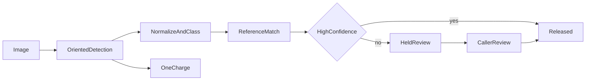

# Architecture

Status: Implemented—not externally validated.

Anchortext reads text from a 2D image, including engineering drawings with mixed orientations, normalizes it, matches the normalized text to a caller-registered S3 JSON reference, and charges once per image.

## Problem

There is no low-cost service that both reads all text from an arbitrary 2D image and reconciles the normalized text against a caller-registered reference. Callers otherwise stitch OCR and matching together and pay full cloud-OCR rates on every image.

## Language

**Image**: a 2D raster picture, including a picture of an engineering drawing. Avoid: CAD file, DWG, DXF.

**Text region**: a four-corner area of text on an image, with an orientation. Avoid: axis-aligned box, mask, keypoint.

**Text class**: dimension, tolerance, thread callout, surface finish, part tag, revision, sheet metadata, or note.

**Transcript**: the raw recognizer output, and the normalized engineering-format correction of that output.

**Annotation**: one text region plus its transcripts, text class, confidence, domain-validation score, and any reference match. It is released or held.

**Released**: returned without waiting for a person.

**Held**: withheld until the caller’s user accepts or edits it.

**Review task**: the caller’s work item for held annotations. Avoid: labeling task.

**Reference source**: a caller-registered S3 JSON document, identified by a source id.

**Match**: a regex or fuzzy comparison of a normalized transcript to an entry in the reference source. Avoid: semantic match.

**Work level**: `standard` (one pass) or `oriented` (tiled, rectified, four-way recognition). Work level sets the price. Avoid: tier.

**Engine**: the recognizer. This cut uses PaddleOCR (PP-OCRv6 small). Avoid: tier.

**Usage charge**: the single charge for one image, recorded when detection finishes. Review does not add a charge.

## Goals

- Extract every text region from a 2D image, including text that is horizontal, vertical, upside down, outside the sheet, or slightly rotated.
- Represent each region as a quadrilateral with an orientation, raw transcript, normalized transcript, confidence, and a text class.
- Match normalized text to the registered reference and return the matched entry and match score.
- Release high-confidence annotations on the sync response. Hold low-confidence ones until the caller’s user accepts or edits them.
- Charge once per image when detection finishes, priced by work level. Review and edits add no second charge.
- Keep the engine on self-hosted PaddleOCR.

## What this cut does not do

CAD-native extraction, keypoints, masks, generic object boxes, leader-line association, other OCR engines, semantic match, extra reference sources, an SDK, an in-house review team, a second charge for review, a sync SLA tier, multi-region deployment, and async batch jobs other than the review task.

## Initiatives

The product is billable only when all six exist.

| Initiative | Scope |
|---|---|
| Oriented detection | Tile large images, detect four-corner regions, rectify each crop, try 0/90/180/270, keep the best transcript. Record `standard` or `oriented` |
| Engineering normalization | Assign a text class and a normalized transcript. Keep the raw string. Score domain validation with OCR confidence to release or hold |
| Reference match | Register an S3 JSON source. Match with regex and fuzzy match. Unknown `source_id` is 404 and does not detect |
| Review hold | Sync detect returns released annotations plus held review tasks. A minimal UI lets the caller’s user accept or edit held regions |
| Usage charge | One charge per image when detection finishes, keyed by work level. Later edits do not rebill |
| Contract update | Annotation carries polygon, rotation, raw and normalized text, text class, validation score, and release state |

## Flow

A sync detect call does not wait on a person. A small image whose quadrilaterals are horizontal is `standard`. Upside-down text on a horizontal baseline stays on that pass. If that read misses the release bar, the region is held and the work level stays `standard`. A quadrilateral whose longest edge is at least 20° from horizontal discards the standard read, runs the tiled, rectified, four-angle path, and is `oriented`. An image whose longest side is at least 1600 pixels skips the standard pass and starts on that same path. 1600 is the starting cutoff. Detection runs off the API event loop.

## Contract

Implemented in `app/schemas.py` and `app/main.py`. API version is `/v1`.

- `POST /v1/detect` returns `work_level`, one `usage_charge`, `released` annotations, and `held` review tasks.
- `POST /v1/match-config` and `GET /v1/match-config/{source_id}` register an `s3_json` source.
- `GET /v1/reviews/{review_id}` reads a review task.
- `POST /v1/reviews/{review_id}/corrections` accepts or edits held annotations and does not create a charge.
- An unknown `source_id` is 404. Detection and charging do not run.

An annotation carries `text_raw`, `text_normalized`, `text_class`, `polygon`, `rotation_degrees`, `confidence`, `domain_validation_score`, `matched_ref`, `match_score`, and `release_state`.

A correction may accept a held annotation or replace `text_normalized` and `text_class`. Raw transcript, polygon, and confidence stay as detected.

## Behavior

- A region that clears both OCR confidence and the domain-validation score is released. The charge is still recorded once, at the work level that ran.
- A region that misses the bar is omitted from `released` and returned inside an open review task. The charge is still recorded.
- Accepting or editing a held region releases it and does not write a second charge.
- The release-bar cutoffs are placeholders until production traffic exists.

## Decisions

- [PaddleOCR as the engine](decisions/0001-detection-engine-strategy.md)
- [Work-level price and caller review hold](decisions/0002-work-level-pricing-and-review-hold.md)
